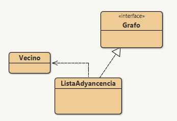

# Práctica Grafos
> Pantoja Bustamante Gabriel
## Implementación Base



## Métodos 
- [Número de Vertices](#número-de-vertices)
- [Número de Aristas](#número-de-aristas)
- [Existe Arista](#existe-arista)
- [Peso Arista](#peso-arista)
- [Insertar Arista](#insertar-arista)
- [Obtener Adyacentes](#obtener-adyacentes)
- [Dibujar Grafo](#dibujar-grafo)
- [Quitar Arista](#quitar-arista)
- [Es Grafo Completo](#es-grafo-completo)
- [Es Grafo Ciclo](#es-grafo-ciclo)
- [Es Grafo Rueda](#es-grafo-rueda)
- [Existe Bucle](#existe-bucle)

## Lista de Adyacencia

```java
private HashMap<Integer, ArrayList<Vecino>> grafo;
```

### Número de Aristas. [métodos](#métodos)
Devolvemos la variable que cuenta las Aristas.
```java
  private int cantAristas;
```

### Existe Arista. [métodos](#métodos)
### Peso Arista [métodos](#métodos)
### Insertar Arista. [métodos](#métodos)
### Obtener Adyacentes. [métodos](#métodos)
### Dibujar Grafo. [métodos](#métodos)
### Quitar Arista. [métodos](#métodos)
### Es Grafo Completo. [métodos](#métodos)
### Es Grafo Ciclo. [métodos](#métodos)
### Es Grafo Rueda. [métodos](#métodos)
### Existe Bucle. [métodos](#métodos)


