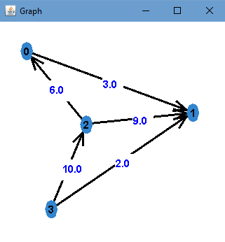
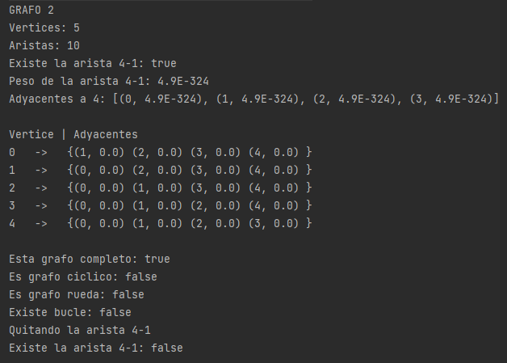

# **Práctica Grafos**
> Pantoja Bustamante Gabriel

El código base se encuentra en el paquete [***logic***](https://github.com/GabrielPB96/GrafoPractica1/tree/master/src/logic), la clase [***Main***](https://github.com/GabrielPB96/GrafoPractica1/tree/master/src/main/Main.java) en el paquete [***main***](https://github.com/GabrielPB96/GrafoPractica1/tree/master/src/main) [^1].

## **Implementación Base**


## **Métodos**
- [Número de Vertices](#número-de-vertices)
- [Número de Aristas](#número-de-aristas)
- [Existe Arista](#existe-arista)
- [Peso Arista](#peso-arista)
- [Insertar Arista](#insertar-arista)
- [Obtener Adyacentes](#obtener-adyacentes)
- [Dibujar Grafo](#dibujar-grafo)
- [Quitar Arista](#quitar-arista)
- [Es Grafo Completo](#es-grafo-completo)
- [Es Grafo Ciclo](#es-grafo-ciclo)
- [Es Grafo Rueda](#es-grafo-rueda)
- [Existe Bucle](#existe-bucle)

## **Lista de Adyacencia**

```java
  public class ListaAdyacencia implements Grafo{
    private HashMap<Integer, ArrayList<Vecino>> grafo;
    private boolean dirigido;
    private int cantVertices, cantAristas, cantLazos;
    private Verificador verificador;
  }
```

## **Número de Vertices.**

```java
  @return Retornar la variable que cuenta los Vertices.
  int getNumVertices()
```

## **Número de Aristas.**

```java
  @return Retorna la variable que cuenta las Aristas.
  int getNumAristas()
```

## **Existe Arista.**
Obtenemos los adyacentes del vertice origen, controlando que este exista, posteriormente verificamos si el vertice destino se encuentra en los adyacentes del vertice origen.
```java
  @param origen - Referencia al origen de la arista.
  @param destino - Referencia al destino de la arista.
  @return True si existe la arista False en otros casos.
  boolean existeArista(int origen, int destino)
```
## **Peso Arista.**
Obtenemos los adyacentes del vertice origen controlando queeste existe. Buscamos el Vecino que coincida con elvertice destino y obtenemos su peso.

```java
  @param origen - Referencia al origen de la arista.
  @param destino - Referencia al destino de la arista.
  @return El peso de la arista o Double.MIN_VALUE si el grafo  no es ponderado. 
  @thorws Exception si la arista no existe.
  double getPesoArista(int origen, int destino) throws Exception
```

## **Insertar Arista.**
Insertamos un nuevo elemento en la lista de adyacencia del vertice origen. Incrementamos el contador de aristas y si el origen es igual al destino, incrementamos el contador de lazos.

```java
  @param origen - Referencia al origen de la nueva arista.
  @param destino - Referencia al destino de la nueva arista.
  void insertarArista(int origen, int destino)
```

```java
  @param origen - Referencia al origen de la nueva arista.
  @param destino - Referencia al destino de la nueva arista.
  @param peso - El peso de la arista.
  void insertarArista(int origen, int destino, double peso)
```

## **Obtener Adyacentes.**
Retornar la lista asociada al vertice, si este no existe, devolvemos una lista vacia.

```java
  @param vertice - Referencia al vertice del cual se obtendra los adyacentes.
  @return Un ArrayList con los adyacentes, si el vertice existe, un ArryaList vacio en otros casos.
  ArrayList<Vecino> getAdyacentes(int vertice)
```

## **Dibujar Grafo.**

El paquete [***graphic***](https://github.com/GabrielPB96/GrafoPractica1/tree/master/src/graphic) contiene el graficador de grafos.

|              <center>Gráfico</center>          |  <center>Consola</center>     |
|-------------------------------|-------------|
|    |    |


## **Quitar Arista.**

Obtener la lista de adyacencia del vertice origen, controlando que este exista, buscamos el el destino y lo eliminamos.

Si el grafo es no dirigido hacemos el mismo proceso pero tomando el destino como origen y el origen como destino.

```java
  @param origen - Referencia al origen de la arista.
  @param destino - Referencia al destino de la arista.
  @return True si la arista existe y fue eliminada, False en otros casos.
  boolean quitarArista(int origen, int destino)
```


**Para los métodos restantes se créo una clase abstracta Verificador y dos subclases, VerificadorDirigido y VerificadorNoDirigido.**


## **Es Grafo Completo.**

> En teoría de grafos, un grafo completo es un grafo simple donde cada par de vértices está conectado por una arista.

Para que un grafo sea completo debe existir una arista para cada par de vertices.
Para un grafo no dirigido esto se puede verificar usando combinaciones, ya que la arista A-B es igual a B-A, las combinaciones nos ayudan a no tomar en cuenta las aristas repetidas.
La cantidad de aristas debe ser igual a **_nC2_** donde n es la cantidad de vertices.


Aplicando esta formula podemos verificar si un grafo es completo.
Para un grafo dirigido podemos hacer una pequeña modificación a esta formula, si el grafo tiene dos aristas por cada par de vertices este seria la cantidad maxima de aristas que puede tener esto es ***2(nC2)***, y la cantidad minima de aristas que puede tener y ser completo es **_nC2_**, entonces la cantidad de aristas de un grafo dirigido debe estar entre estos dos valores ***nC2 >= cantAristas <= 2(nC2)***.

```java
  @return True si el grafo es completo, False en otros casos.
  boolean esCompleto()
```

## **Es Grafo Ciclo.**

> En teoría de grafos, un grafo ciclo o simplemente ciclo es un grafo que consiste en un camino simple cerrado, es decir, en el que no se repite ningún vértice, salvo el primero con el último. El número de vértices en un grafo ciclo es igual al número de aristas.

Un grafo ciclo tiene la misma cantidad de vertices y aristas.

*Para un grafo dirigido verificados que las aristas tengan la misma dirección.*

```java
  @return True si el grafo es ciclo, False en otros casos.
  boolean esGrafoCiclo()
```

## **Es Grafo Rueda.**

> En teoría de grafos, un grafo rueda (Wn), o simplemente rueda, es un grafo con n vértices que se forma conectando un único vértice a todos los vértices de un ciclo-(n-1).

En un grafo no dirigido la cantidad de aristas debe ser igual a ***2(n-1)*** (donde n es la cantidad de vertices), esto debido a que si quitados el vertice rueda la cantidad de aristas es igual a ***(n-1)***, a esto le sumamos el grado de dicho vertice, que tambien es ***(n-1)***.

Para un grafo dirigido el número maximo de aristas sera ***4(n-1)*** y el número minimo ***2(n-1)***, para que el grafo sea rueda la cantidad de aristas debe estar en este rango.

```java
  @return True si el grafo es rueda, False en otros casos.
  boolean esGrafoRueda()
```

## **Existe Bucle.**

Si la cantidad de lazos es mayor a cero, entonces si existe un bucle.

```java
  @return True si existe bucle, False en otros casos.
  boolean existeBucle()
```


## **Resultados**
## Grafo 1

|<center>Grafo</center>|<center>Resultados</center>|
|------|------|
|||

|<center>Gráfico Inicial</center>|<center>Gráfico Final</center>      |
|------|------|
|||


## Grafo 2

|<center>Grafo</center>|<center>Resultados</center>|
|------|------|
|||

|<center>Gráfico Inicial</center>|<center>Gráfico Final</center>      |
|-----|-----|
|||

## Grafo 3

|<center>Grafo</center>|<center>Resultados</center>|
|------|------|
|||

|<center>Gráfico Inicial</center>|<center>Gráfico Final</center>      |
|------|------|
|||


[^1]: Instalar Java16 e IntelliJ.
